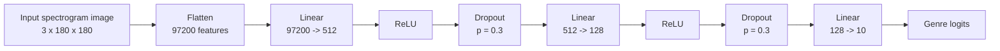
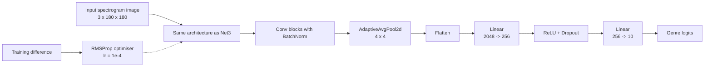
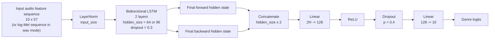
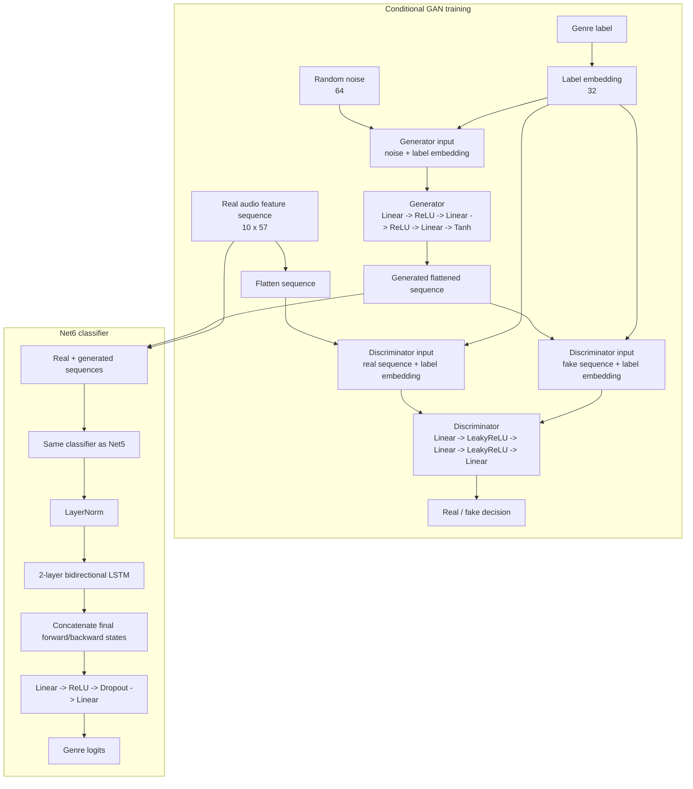

# Model Architecture Diagrams

These diagrams match the current implementation in `music_genre_source.py`.

## Net1: Fully Connected Network

## Net2: CNN

```mermaid
flowchart LR
    A["Input spectrogram image<br/>3 x 180 x 180"] --> B["Conv2d<br/>3 -> 32<br/>3x3, padding 1"]
    B --> C["ReLU"]
    C --> D["Conv2d<br/>32 -> 64<br/>3x3, padding 1"]
    D --> E["ReLU"]
    E --> F["MaxPool2d<br/>2x2"]
    F --> G["Conv2d<br/>64 -> 128<br/>3x3, padding 1"]
    G --> H["ReLU"]
    H --> I["Conv2d<br/>128 -> 128<br/>3x3, padding 1"]
    I --> J["ReLU"]
    J --> K["MaxPool2d<br/>2x2"]
    K --> L["AdaptiveAvgPool2d<br/>4 x 4"]
    L --> M["Flatten<br/>128 x 4 x 4"]
    M --> N["Linear<br/>2048 -> 256"]
    N --> O["ReLU"]
    O --> P["Dropout<br/>p = 0.3"]
    P --> Q["Linear<br/>256 -> 10"]
    Q --> R["Genre logits"]
```

## Net3: CNN + Batch Normalisation

```mermaid
flowchart LR
    A["Input spectrogram image<br/>3 x 180 x 180"] --> B["Conv2d<br/>3 -> 32"]
    B --> C["BatchNorm2d<br/>32"]
    C --> D["ReLU"]
    D --> E["Conv2d<br/>32 -> 64"]
    E --> F["BatchNorm2d<br/>64"]
    F --> G["ReLU"]
    G --> H["MaxPool2d<br/>2x2"]
    H --> I["Conv2d<br/>64 -> 128"]
    I --> J["BatchNorm2d<br/>128"]
    J --> K["ReLU"]
    K --> L["Conv2d<br/>128 -> 128"]
    L --> M["BatchNorm2d<br/>128"]
    M --> N["ReLU"]
    N --> O["MaxPool2d<br/>2x2"]
    O --> P["AdaptiveAvgPool2d<br/>4 x 4"]
    P --> Q["Flatten"]
    Q --> R["Linear<br/>2048 -> 256"]
    R --> S["ReLU"]
    S --> T["Dropout<br/>p = 0.3"]
    T --> U["Linear<br/>256 -> 10"]
    U --> V["Genre logits"]
```

## Net4: CNN + Batch Normalisation + RMSProp

## Net5: LSTM Audio Classifier

## Net6: LSTM with Conditional GAN Augmentation

## Short Summary

| Model | Input | Main idea | Training difference |
|---|---|---|---|
| Net1 | Spectrogram image | Fully connected baseline | Adam |
| Net2 | Spectrogram image | CNN feature extraction | Adam |
| Net3 | Spectrogram image | CNN + BatchNorm | Adam |
| Net4 | Spectrogram image | Same as Net3 | RMSProp |
| Net5 | Audio feature sequence | BiLSTM classifier | Adam |
| Net6 | Audio feature sequence | Net5 + GAN augmentation | Adam + conditional GAN |
